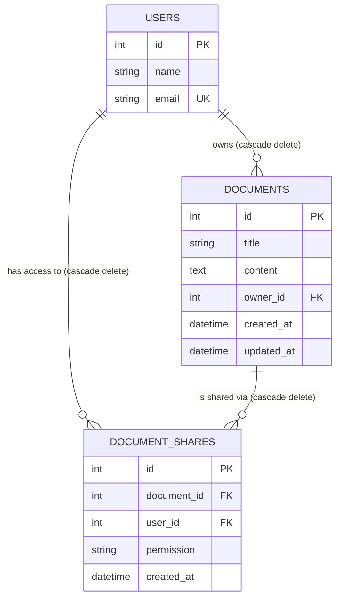
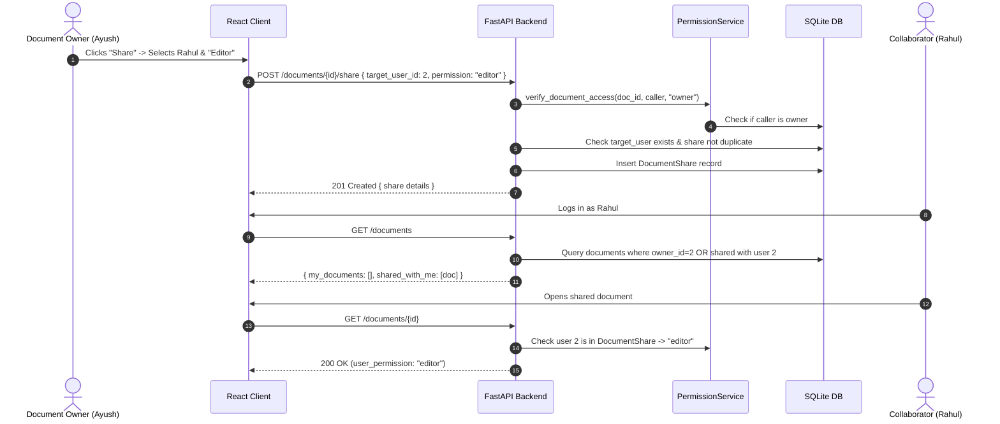

# System Architecture — Ajaia Docs

This document outlines the technical architecture, data model, security design, and engineering tradeoffs implemented in **Ajaia Docs**.

---

## 1. High-Level Product Architecture

Ajaia Docs follows a decoupled client-server architecture:

```
┌────────────────────────────────────────────────────────┐
│                   React + Vite Client                  │
│  (React Router, Tiptap Editor, Tailwind CSS, Context)  │
└───────────────────────────┬────────────────────────────┘
                            │ HTTP JSON / Multipart
                            │ X-User-Id Authentication
┌───────────────────────────▼────────────────────────────┐
│                    FastAPI Backend                     │
│  ├── Routers: /auth, /users, /documents                │
│  ├── Dependencies: get_current_user, get_db            │
│  └── Services: DocumentService, PermissionService,     │
│                ShareService, ImportService             │
└───────────────────────────┬────────────────────────────┘
                            │ SQLAlchemy 2.0 ORM
┌───────────────────────────▼────────────────────────────┐
│                   SQLite Database                      │
│      Tables: users, documents, document_shares         │
└────────────────────────────────────────────────────────┘
```

---

## 2. Frontend Architecture

The frontend is structured into modular layers adhering to separation of concerns:

- **State & Context (`src/context/`)**:
  - `AuthContext`: Tracks current authenticated demo user, handles session persistence in `localStorage`, and exposes `login()`, `logout()`, and `isAuthenticated`.
- **API Client Layer (`src/api/`)**:
  - `client.ts`: Centralized HTTP fetcher that automatically attaches `X-User-Id` headers from local storage, standardizes error responses into `ApiError` instances, and handles network connection drops.
  - Domain-specific modules (`auth.ts`, `users.ts`, `documents.ts`) decouple UI components from network calls.
- **Component Layer (`src/components/`)**:
  - `TiptapEditor.tsx`: Embeds the ProseMirror-powered Tiptap editor engine, handles external content synchronization without disruptive re-renders, and toggles read-only mode for viewers.
  - `EditorToolbar.tsx`: Rich-text formatting controls (headings, bold, italic, underline, strike, lists, blockquote, code, horizontal rules, history).
  - `DocumentCard.tsx`, `Navbar.tsx`, `ShareModal.tsx`, `ImportModal.tsx`, `DeleteModal.tsx`, `LoadingSpinner.tsx`, `EmptyState.tsx`.
- **Page Layer (`src/pages/`)**:
  - `LoginPage.tsx`: Demo account selection and authentication.
  - `DashboardPage.tsx`: "My Documents" & "Shared With Me" grids, tabs, search, import, and delete handlers.
  - `EditorPage.tsx`: Document editor workspace with inline title editing, real-time save status badge, keyboard shortcuts (`Ctrl+S`), and error handling (`403` / `404`).

---

## 3. Backend Architecture

The backend follows a layered service-oriented pattern:

1. **Routers (`app/routers/`)**: Handle HTTP request validation, parameter parsing, status codes, and routing.
2. **Services (`app/services/`)**: Encapsulate all business logic and authorization enforcement:
   - `PermissionService`: Centralized permission engine enforcing owner, editor, and viewer rights.
   - `DocumentService`: Document lifecycle, serialization, and grouped listing (`my_documents` vs `shared_with_me`).
   - `ShareService`: Validations for document sharing (preventing self-sharing and duplicate shares).
   - `ImportService`: File extension checking, text decoding, and transformation into Tiptap JSON.
3. **Database & Models (`app/models/`, `app/database.py`)**: Declarative SQLAlchemy models with foreign keys, cascading deletions, and unique constraints.
4. **Dependencies (`app/dependencies.py`)**: Reusable FastAPI dependency injection for database sessions (`get_db`) and user resolution (`get_current_user`).

---

## 4. Database Schema & Data Integrity



### Schema Constraints:
- **`users.email`**: Unique index preventing duplicate user registrations.
- **`documents.owner_id`**: Foreign key to `users.id` with `ondelete="CASCADE"`.
- **`document_shares.document_id`**: Foreign key to `documents.id` with `ondelete="CASCADE"`.
- **`document_shares.user_id`**: Foreign key to `users.id` with `ondelete="CASCADE"`.
- **`UniqueConstraint("document_id", "user_id")`**: Database-level constraint guaranteeing that a document cannot have duplicate shares for the same user.

---

## 5. Authentication Approach

- **Lightweight Demo Authentication**: Designed for evaluating the assignment without external OAuth or password setup friction.
- **User Resolution**: The backend accepts `X-User-Id` in request headers, Bearer tokens in `Authorization`, or `user_id` query parameters.
- **Security Validation**: If the user ID does not exist or is omitted, requests to protected routes fail immediately with `401 Unauthorized`.
- **Frontend Storage**: The authenticated user object is stored in browser `localStorage` and injected into every outgoing request by `src/api/client.ts`.

---

## 6. Document Persistence & Tiptap JSON Format

- **Content Storage**: Document content is stored as JSON text in SQLite and parsed to structured JSON in Pydantic responses.
- **Editor Compatibility**: Tiptap uses ProseMirror JSON format:
  ```json
  {
    "type": "doc",
    "content": [
      {
        "type": "heading",
        "attrs": { "level": 1 },
        "content": [{ "type": "text", "text": "Document Title" }]
      },
      {
        "type": "paragraph",
        "content": [{ "type": "text", "text": "Body content here..." }]
      }
    ]
  }
  ```
- **Auto-Save Mechanism**: The frontend debounces user keystrokes (1200ms) to reduce unnecessary database writes while ensuring work is continuously saved. Changes can also be saved manually via `Ctrl+S` or the Save button.

---

## 7. Sharing & Access Control Flow



### Authorization Rules:
| Action | Owner | Shared Editor | Shared Viewer | Unshared User |
|---|:---:|:---:|:---:|:---:|
| `GET /documents/{id}` | Allowed | Allowed | Allowed | `403 Forbidden` |
| `PUT /documents/{id}` | Allowed | Allowed | `403 Forbidden` | `403 Forbidden` |
| `DELETE /documents/{id}` | Allowed | `403 Forbidden` | `403 Forbidden` | `403 Forbidden` |
| `POST /documents/{id}/share` | Allowed | `403 Forbidden` | `403 Forbidden` | `403 Forbidden` |
| `DELETE /documents/{id}/share/{user_id}` | Allowed | `403 Forbidden` | `403 Forbidden` | `403 Forbidden` |


---

## 8. File Import Flow

1. User selects a `.txt` or `.md` file in the UI modal.
2. The file is uploaded via `multipart/form-data` to `POST /documents/import`.
3. `ImportService` validates the file extension (rejecting unsupported types with `400 Bad Request`).
4. File bytes are decoded as UTF-8.
5. Markdown headings (`#`, `##`, `###`) and paragraphs are parsed into a valid Tiptap JSON tree.
6. A new `Document` record is inserted with the filename stem as the document title.
7. The API returns `201 Created` with the document object, and the frontend navigates directly to `/document/:id`.

---

## 9. Key Engineering Decisions

1. **Decoupled Permission Layer**: Kept authorization checks in a dedicated `PermissionService` rather than mixing access rules inside route handlers, simplifying unit testing and future role expansion.
2. **Standardized Tiptap JSON**: Chose ProseMirror/Tiptap JSON schema over raw HTML strings to avoid XSS vulnerabilities and maintain strict document structure consistency.
3. **In-Memory SQLite Test Fixtures**: Configured `pytest` fixtures with `sqlite:///:memory:` and `StaticPool` to ensure automated tests run fast without modifying or corrupting the development database.
4. **Resilient Network Client**: Wrapped the browser fetch API with automatic auth headers, timeout handling, error message normalization, and connection health warnings.

---

## 10. What Was Intentionally Deprioritized

- **WebSocket / CRDT Collaborative Editing (Yjs / Liveblocks)**: Deprioritized to maintain a clean, stable single-server architecture focused on robust CRUD, permission enforcement, and fast debounced persistence.
- **Complex RBAC & OAuth Providers**: A demo authentication strategy was selected to eliminate evaluator setup friction (no API keys, redirect URIs, or database password migrations).
- **Binary Document Parsing (PDF / DOCX)**: PDF and DOCX parsing introduces heavy external binary dependencies and inconsistent formatting fidelity; `.txt` and `.md` formats were chosen for reliable, clean document import.
- **Comment Threads & Version Revision Diffs**: Deprioritized to focus engineering effort on core usability, complete test coverage, and a responsive editing experience.
